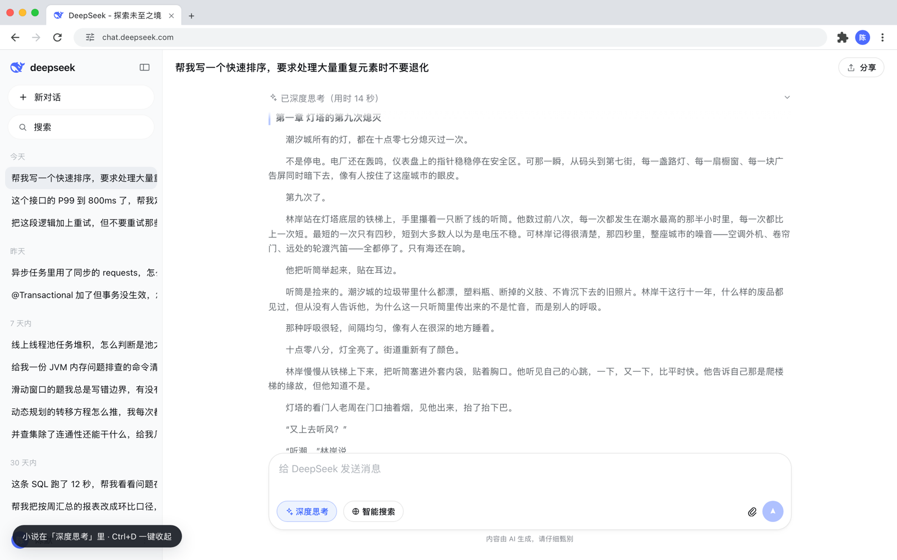

# NovelFish

把小说藏在「深度思考」里的阅读器：页面与 DeepSeek 网页版保持一致，**只有点开那段折叠的推理过程，才会看到正文**。

> ### 非官方声明
>
> 本项目是**个人自用工具**，与 DeepSeek（杭州深度求索人工智能基础技术研究有限公司）**没有任何关系**，未获其授权、认可或赞助。
>
> - 仓库内**不含**任何官方代码、图标位图、字体或后端接口，界面完全由本项目自行编写。
> - 「DeepSeek」等名称与标识归其权利人所有，此处仅作界面参考描述之用。
> - 请仅将本项目用于**阅读你自己有权阅读的内容**，并遵守你所在组织的设备与网络使用规定。
>
> 使用本项目产生的任何后果由使用者自行承担。

---

## 它长什么样



三层结构，逐层展开：

| 层 | 可见性 | 作用 |
| --- | --- | --- |
| 浏览器外框 | 一直可见 | macOS / Windows 双系统 × Chrome / Edge 双外框，含地址栏、书签栏、扩展图标、个人资料菜单 |
| DeepSeek 皮肤 | 一直可见 | 侧边栏、会话列表、输入框、消息气泡、思考折叠条、分享弹窗 |
| 小说阅读器 | 只在点开「深度思考」后 | 正文章节、翻章、进度、EPUB 导入 |

按 <kbd>Ctrl</kbd>/<kbd>Cmd</kbd> + <kbd>D</kbd> 一键收起（老板键，只收不放，再按一次不会弹回来）。

## 快速开始

不需要构建，不需要依赖：

```bash
git clone <repo> && cd NovelFish
./start.sh            # 起本地服务并自动打开浏览器
./start.sh 9000       # 指定端口
```

也可以直接**双击 `index.html`** —— `file://` 下全部功能可用（皮肤样式由 JS 动态注入，不受跨域限制）。

## 对话能力

输入框可以真实打字，回答会逐字流式上屏。走哪条路由**触发词**决定：

```
命中触发词  ──→  伪装剧本：深度思考里是小说正文，回答是预置内容
不含触发词  ──→  真实模型：深度思考里是模型的真实推理
```

- **触发词两层优先级**：各剧本自带的专属触发词优先，其次全局「阅读触发词」（默认 `继续 / 下一章 / 接着读`）。
- **走模型时深度思考默认打开**，展示的就是模型吐出的 `reasoning_content` 原文，不做任何加工；模型不给推理（多数 chat 类模型）时整块「深度思考」会撤掉，而不是留一个空壳。
- **没配置模型时一律退回剧本**，保证刚打开就能用。

### 接入真实模型

设置 → **模型** 标签页，填四项即可：`baseUrl` / `apiKey` / `model` / 可选「额外请求参数」。

内置八条服务商预设：DeepSeek、OpenAI、智谱、Moonshot、通义、硅基流动、Ollama、自定义中转站。走的是标准 OpenAI 兼容协议（`/chat/completions` + SSE），所以**任何兼容该协议的服务都能直接用**，包括自建网关。

Key 只存在浏览器的 `localStorage` 里，不经过任何第三方服务器。

### 自建伪装剧本

设置 → **伪装** 标签页可新建、另存副本、编辑、删除剧本，每个剧本可单独设置：

- 名称与话题
- **专属触发词**（命中即走这个剧本）
- 命中时「深度思考」默认展开还是收起
- `Q: / A:` 形式的问答对

内置 13 个技术话题剧本（后端、算法、SQL、K8s、排障、周报写作等），照着抄一份改就行。

## 阅读能力

- 纯文本与 **EPUB** 导入（支持 EPUB3 `nav` 与 EPUB2 `NCX` 两种分章方式，坏文件有兜底）
- 章节列表跳转、阅读进度记忆、逐字自动滚动
- **分享**：把「深度思考」里的整本书压进 URL fragment（`#nf=...`），对方粘回窗口即还原；超长书自动降级为下载 `.txt` 副本

## 目录结构

```
index.html              入口，皮肤与样式按需注入
css/
  base.css              外壳无关的通用样式
  browser.css           Chrome / Edge × macOS / Windows 外框
  reader.css            阅读器
  skins/                每个皮肤一个文件
js/
  core/
    app.js              应用编排：设置、会话、分享、模型路由
    llm.js              OpenAI 兼容客户端（SSE 流式、错误分类、连接探针）
    camouflage.js       伪装剧本引擎（内置 + 自建、触发词匹配）
    store.js            状态、持久化、事件总线、工具函数
    novel.js            章节解析
    epub.js             EPUB 解包
    chat.js             会话消息模型
    share.js            分享载荷编解码
    chrome.js           浏览器外框
    skins.js            皮肤注册与热切换
  data/                 内置剧本库、图标、示例小说
  skins/                皮肤实现（deepseek / gpt / _template）
tools/
  smoke.js              端到端冒烟测试（Playwright）
  verify-layout.js      对几何：打印实测值，跟 DS 官网样式包的值并排比
  mock-llm.js           零依赖假模型服务
  fixtures/             EPUB 测试样本
```

皮肤是插件化的：复制 `js/skins/_template.js`，实现渲染与事件回调即可，核心不感知皮肤。

## 测试

```bash
# 终端 1
python3 -m http.server 8931 --bind 127.0.0.1

# 终端 2
NODE_PATH=<playwright 所在 node_modules> node tools/smoke.js
```

布局还原的依据不是肉眼估算，而是 `chat.deepseek.com` 的线上样式包
（`fe-static.deepseek.com/chat/static/main.<hash>.css` + 同名 `.js` 里的
CSS Modules 类名映射表）。「官网类名 → 本地变量」的全表存在
`css/skins/deepseek.css` 头部；想复核实测几何时：

```bash
NODE_PATH=<playwright 所在 node_modules> node tools/verify-layout.js
```

它会关掉浏览器外框（让内容正好铺满视口），依次打印外框壳、首页态、对话态
三组实测几何，跟脚本头部注释里的期望值逐条比。

330 项断言，覆盖渲染、老板键、EPUB、分享往返、触发词分流、真实模型对话流式、自建剧本、四类错误分类、刷新持久化等。**脚本自带假模型服务，不需要任何真实 API Key。**

## 部署

仓库根目录是纯静态站点，可直接作为 GitHub Pages 源（`main` 分支 / 根目录）。

> 注意：Pages 是 `https`，浏览器会拦截 `http://` 的混合内容请求。若你的模型服务跑在本机且没有 TLS，请改用 `./start.sh` 在 `http://127.0.0.1` 下访问，或给网关配上证书。

## 许可

MIT，见 [LICENSE](LICENSE)。再次提醒：MIT 只覆盖本仓库的代码，不构成对第三方界面设计、名称或商标的任何授权。
